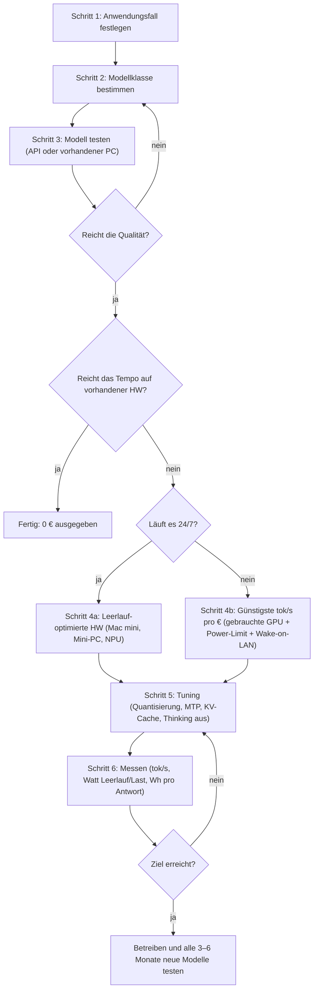
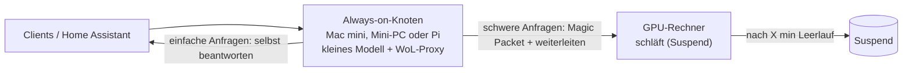

# Lokale KI: Maximale Leistung pro Euro und pro Watt

**Workflow + Tricks + Ausblick** · Stand: 24.09.2026

> **Kurzfassung**
>
> 1. **Nicht zuerst Hardware kaufen.** Erst Anwendungsfall festlegen, das Modell über eine API
>    oder deinen vorhandenen PC testen, dann die *kleinste* Hardware kaufen, auf der es läuft.
> 2. **MoE-Modelle + 4-Bit-Quantisierung** sind der größte Hebel. Beispiele: Qwen3.6-35B-A3B,
>    Gemma 4 26B-A4B, gpt-oss-20b. Sie liefern Qualität der ~30B-Klasse mit der Geschwindigkeit
>    eines 3–4B-Modells.
> 3. **Bei 24/7-Betrieb kostet der Leerlauf mehr als das Rechnen.** Jedes Watt Dauerlast kostet
>    rund 2,50 € im Jahr. Deshalb: Gerät mit niedrigem Leerlauf (Mac mini: 4–6 W), oder die große
>    Kiste schlafen legen und per Wake-on-LAN wecken.
> 4. **RAM-Krise 2026:** Neuer Arbeitsspeicher ist 3–5× so teuer wie 2025, und vor Ende 2027
>    ist keine Entspannung in Sicht. Gebrauchte Hardware, in der der Speicher schon steckt, ist
>    darum gerade relativ günstig.
> 5. **Neue Software-Tricks 2026:** MTP (Multi-Token-Prediction) in llama.cpp bringt +40–70 %
>    Tokens pro Sekunde. `--n-cpu-moe` passt große MoE-Modelle auf 12–16-GB-Grafikkarten.
>    Ein GPU-Power-Limit spart ~30 % Strom bei unter 3 % Tempoverlust.

---

## Inhalt

1. [Die Physik dahinter (2 Minuten, lohnt sich)](#1-die-physik-dahinter)
2. [Der Workflow: Schritt für Schritt](#2-der-workflow-schritt-für-schritt)
3. [Modelle (Stand September 2026)](#3-modelle-stand-september-2026)
4. [Hardware-Stufen mit Preisen und Verbrauch](#4-hardware-stufen)
5. [Tricks: Software, Strom, Einkauf](#5-tricks)
6. [Konkrete Setups nach Budget](#6-konkrete-setups-nach-budget)
7. [Bonus: Home Assistant (lokaler Sprachassistent)](#7-bonus-home-assistant)
8. [Was kommt? Kaufen oder warten?](#8-was-kommt)
9. [Quellen und Hinweise](#9-quellen-und-hinweise)

---

## 1. Die Physik dahinter

**Die Textausgabe ist durch die Speicherbandbreite begrenzt, nicht durch die Rechenleistung.**
Für jedes erzeugte Token müssen alle *aktiven* Gewichte einmal aus dem Speicher gelesen werden.

```
max. Tokens/s  ≈  Speicherbandbreite (GB/s)  ÷  aktive Parameter (Mrd.) × Bytes pro Gewicht
real           ≈  50–70 % davon
```

| Beispiel (Q4 ≈ 0,55 Byte/Gewicht) | Daten pro Token | bei 150 GB/s | bei 300 GB/s |
|---|---|---|---|
| Dichtes 27B-Modell | ~15 GB | ~10 tok/s | ~20 tok/s |
| MoE 35B mit **3B aktiv** | ~1,7 GB | ~90 tok/s | ~175 tok/s |

*(theoretische Obergrenzen)*

Daraus folgen drei Regeln:

- **Die Speichermenge entscheidet, *welches* Modell passt.** Das gilt für VRAM und für den
  gemeinsamen Speicher (Unified Memory) von Apple-Chips und Strix Halo.
- **Die Bandbreite entscheidet, *wie schnell* es läuft.**
- **MoE-Modelle umgehen das Problem:** Sie sind groß im Speicher, aber pro Token wird nur ein
  kleiner Teil gelesen. Deshalb laufen sie auch auf billiger Hardware und sogar mit Teilen im
  normalen Arbeitsspeicher schnell.

**Strom-Faustregel (Deutschland, ~28 ct/kWh im September 2026):**

```
1 Watt rund um die Uhr = 8,76 kWh/Jahr ≈ 2,50 €/Jahr
```

| Szenario | Leerlauf | Kosten nur Leerlauf/Jahr |
|---|---|---|
| Mac mini M6 (Herstellerangabe) | 4 W | ~10 € |
| Mac mini M5 Pro (Herstellerangabe) | 6 W | ~15 € |
| Desktop mit RTX 3090, 24/7 an (Schätzung, selbst messen!) | 50–80 W | ~125–200 € |

Was eine Antwort selbst kostet: 1.000 Tokens bei 50 tok/s und 60 W Last ≈ 0,33 Wh ≈ **0,01 Cent**.
Bei Heimnutzung kosten also **Leerlauf und Bereitschaft** das Geld, nicht die Antworten.

---

## 2. Der Workflow: Schritt für Schritt



### Schritt 1: Anwendungsfall festlegen

Kreuz an, was du brauchst. Das bestimmt die Modellklasse:

- [ ] Einfache Befehle, Klassifizieren, kurze Zusammenfassungen → **Klasse S** (1–4B)
- [ ] Sprachassistent (Home Assistant), Tool-Calling, Alltags-Chat → **Klasse M** (MoE mit 3–4B aktiv, oder 8–9B dicht)
- [ ] Programmieren, schwierigeres Reasoning, lange Dokumente → **Klasse L** (27–31B dicht oder großes MoE)
- [ ] „Fast wie Cloud“, Agenten, sehr lange Kontexte → **Klasse XL** (100B+ MoE, braucht 64–128 GB)
- [ ] Bilder verstehen (Vision) → multimodale Modelle (Gemma 4, Qwen3.6/3.8)

### Schritt 2: Modellklasse → Kandidaten

Siehe [Abschnitt 3](#3-modelle-stand-september-2026). Nimm 2–3 Kandidaten.

### Schritt 3: Testen, *bevor* du kaufst

- **API-Test (kostet ein paar Cent):** Dieselben offenen Modelle gibt es bei Cloud-Anbietern
  mit OpenAI-kompatibler API. Teste dort deine echten Prompts. So findest du heraus, ob dir
  z. B. ein 35B-A3B reicht oder ob es ein 27B-Dense-Modell sein muss. Das vermeidet Fehlkäufe.
- **Lokaler Test mit dem, was du hast:** Jeder PC oder Laptop mit 32 GB RAM kann ein
  35B-A3B-MoE-Modell in Q4 **rein auf der CPU** ausführen. Das ist langsamer, zeigt dir aber
  die Qualität. Mit 16 GB RAM gehen Gemma 4 E4B oder Qwen3.5-4B/9B.
- Werkzeug: `llama.cpp` (llama-server), alternativ Ollama oder LM Studio (mit Oberfläche).

### Schritt 4: Hardware wählen

Siehe [Abschnitt 4](#4-hardware-stufen). Die wichtigste Frage ist **„Läuft es 24/7?“**

- **Ja (z. B. Home Assistant):** Wichtig sind Leerlauf-Watt und Watt pro Token. Beste Wahl sind
  Apple Silicon oder Mini-PCs mit Unified Memory.
- **Nein (nur bei Bedarf):** Wichtig sind Tokens pro Sekunde pro Euro. Gebrauchte GPUs sind am
  günstigsten. Dazu Power-Limit und Schlafmodus plus Wake-on-LAN.

### Schritt 5: Tuning

Siehe [Abschnitt 5](#5-tricks). Die Reihenfolge nach Wirkung:

1. MoE-Modell wählen
2. Q4 als Quantisierung
3. Thinking aus, wo es nicht gebraucht wird
4. MTP einschalten
5. KV-Cache quantisieren
6. Power-Limit setzen
7. Schlafmodus einrichten

### Schritt 6: Messen und nachjustieren

- **Tempo:** `llama-bench -m modell.gguf`, oder die Timings, die `llama-server` in jeder Antwort
  mitschickt.
- **Strom:** Zwischenstecker mit Messfunktion, z. B. eine Shelly Plug, die du direkt in
  Home Assistant einbinden kannst. Miss **Leerlauf**, **Last** und **Wh pro 1.000 Tokens**.
- Trage die Werte in eine Tabelle ein: Modell, Quantisierung, tok/s, Watt (Last), Watt
  (Leerlauf), Qualitätsnote.
- **Alle 3–6 Monate** neue Modelle testen. Die Modell-Updates im Jahr 2026 (Qwen3.5 → 3.6 → 3.8,
  Gemma 4) haben mehr gebracht als jedes Hardware-Upgrade.

---

## 3. Modelle (Stand September 2026)

| Modell | Typ | Aktive Parameter | Speicher in Q4 (ca.) | Wofür | Hinweise |
|---|---|---|---|---|---|
| **Gemma 4 E2B / E4B** | dicht, für Edge-Geräte | ~2B / ~4B effektiv | ~2–4 GB | Mini-Hardware, NPU, Audio-Eingabe | Apache 2.0, April 2026 |
| **Qwen3.5-4B / 9B** | dicht | 4B / 9B | ~3 GB / ~6 GB | Klasse S, einfache Aufgaben | März 2026 |
| **Qwen3.6-35B-A3B** | MoE | **3B** | ~20 GB | **Allrounder mit dem besten Tempo pro €** | MTP-fähig, multimodal, 262K Kontext |
| **Gemma 4 26B-A4B** | MoE | 3,8B | ~14–16 GB (IQ4_XS 13,9 GB) | Sprachassistent, multimodal | Im HA-Forum Favorit (Thinking aus) |
| **gpt-oss-20b** | MoE | ~3,6B | ~13 GB (MXFP4) | Tool-Calling, Home Assistant | stabil, gut für Agenten |
| **Qwen3.8-27B** | dicht | 27B | ~17 GB (Q4_K_M) | **Programmieren und Reasoning**, beste Qualität unter 32 GB | August 2026, MTP-fähig |
| **Gemma 4 31B** | dicht | 31B | ~18–20 GB | Qualität, Vision | zum Launch Platz 3 unter den offenen Modellen in der Arena |
| **gpt-oss-120b / Qwen3.5-122B-A10B** | MoE | ~5B / 10B | ~65–75 GB | Klasse XL auf 128-GB-Geräten | Strix Halo / Mac |

**Quantisierung, was hält und was nicht** (Benchmark mit Qwen3.8-27B):

- **Q8_0:** gleich gut wie das volle Modell.
- **Q4_K_M: kein messbarer Unterschied.** Das ist der Sweetspot.
- **Q2_K_XL:** leichte Verluste. Für einfache Aufgaben okay.
- **1-Bit (IQ1): bricht komplett ein** und landet bei GPQA auf Zufallsniveau. Finger weg.
- Dynamische Quants (z. B. „UD-Q4_K_XL“ von Unsloth) liegen meist ein Stück vor normalen Quants
  derselben Größe.

---

## 4. Hardware-Stufen

> Die Preise stammen überwiegend aus **US-Quellen in USD, Stand September 2026**. In der EU
> sind sie oft ähnlich oder höher, und sie schwanken stark wegen der RAM-Krise.
> Tokens pro Sekunde sind Messwerte aus der Community, keine eigenen Messungen.

### Stufe 0: 0 € (vorhandener PC oder Laptop)

- 32 GB RAM + Qwen3.6-35B-A3B Q4 rein auf der CPU. Damit kannst du Qualität und Workflow testen.
- Laptop mit **AMD-Ryzen-AI-NPU**: **FastFlowLM / Lemonade** schafft ein 3B-Modell mit
  ~28 tok/s bei **unter 2 W**. Seit März 2026 läuft das auch unter Linux.
  Zum Vergleich: Die iGPU braucht dafür 10–15 W.

### Stufe 1: Ultra-Low-Power (< 10–25 W)

| Gerät | Preis | Verbrauch | Kann was? | Urteil |
|---|---|---|---|---|
| Raspberry Pi 5 + **AI HAT+ 2** (Hailo-10H, 8 GB) | günstig | 3,4 W Leerlauf → 5,2 W unter Last | nur Modelle bis ~1,5B | Spielerei. Laut Test sind die Modelle „objektiv schlecht“, und der erste Prompt braucht 25–40 s. Gut für Bildverarbeitung, schwach bei LLMs. |
| **Jetson Orin Nano Super** (8 GB, 102 GB/s) | 249 $ | 7–25 W | kleine Modelle (Klasse S), 25 W ist der beste Modus | Solide für Bastler und Robotik. Für Klasse M reichen die 8 GB nicht. |
| Laptop / Mini-PC mit Ryzen-AI-NPU | vorhanden oder ab Mittelklasse | < 2 W für das LLM | 1–4B über FastFlowLM | Sehr effizient für kleine Always-on-Aufgaben |

### Stufe 2: Preis-Leistungs-Sweetspot (~300–400 $, Desktop vorhanden)

| Karte | Preis | VRAM / Bandbreite | Verbrauch | Community-Werte |
|---|---|---|---|---|
| **RTX 3060 12 GB** (gebraucht) | ~260–300 $ | 12 GB | 170 W TDP | **Qwen3.6-35B-A3B ~51–53 tok/s @ 64K Kontext** (mit `--n-cpu-moe` und 32 GB DDR5) |
| **Intel Arc Pro B50** (neu) | ~349–370 $ | 16 GB / 224 GB/s | **70 W, kein Stromstecker nötig** | leise, sparsam, passt in Mini-Towers. Braucht SYCL/Vulkan statt CUDA. |

Mit `--n-cpu-moe` (siehe Tricks) laufen die großen MoE-Modelle auch auf 12–16 GB schnell.
Nachteil: Ein Desktop hat im Leerlauf deutlich mehr Verbrauch. Deshalb Wake-on-LAN nutzen
(Trick 9).

### Stufe 3: Effizienz-König für 24/7 (~900–1.700 $)

| Gerät | Preis | RAM / Bandbreite | Leerlauf / Max | Passt |
|---|---|---|---|---|
| **Mac mini M6** (neu seit 22.09.2026) | ab 899 $ | 16 GB (bis 32 GB) / bis 170 GB/s | **4 W** / 70 W | 16 GB: Klasse S/M-klein. **32 GB: Qwen3.6-35B-A3B, Gemma 4 26B-A4B** |
| **Mac mini M5 Pro** | ab 1.699 $ | 24 GB (bis 64 GB) / 307 GB/s | **6 W** / 145 W | 64 GB: Qwen3.8-27B in Q6/Q8 plus MoE-Modelle, sogar 70B-Q4 |
| Mac mini M4 / M4 Pro (**gebraucht**) | fallende Preise durch den Nachfolger | bis 64 GB (M4 Pro) | 4–5 W | ähnlich, günstiger |
| **Mac Studio M1/M2 Max 64 GB (gebraucht)** | Einzelangebote um ~1.350 $ | 64 GB / **400 GB/s** | niedrig | **Geheimtipp:** hohe Bandbreite pro Euro, RAM schon verbaut |

> Hinweis: Der Mac mini wurde 2026 zweimal teurer (+200 $ im Juni, +100 $ mit dem M6-Launch).
> Macworld nennt ihn deshalb „kein Budget-Mac mehr“. **Nimm so viel RAM, wie du dir leisten
> kannst.** RAM lässt sich nicht nachrüsten, und 16 GB sind für LLMs knapp.

### Stufe 4: Große Modelle (Klasse L/XL, ~2.000–3.500 $)

| Gerät | Preis 09/2026 | Speicher / Bandbreite | Werte |
|---|---|---|---|
| **AMD Strix Halo** (Ryzen AI Max+ 395, z. B. Framework Desktop, GMKtec EVO-X2) | 64 GB ab ~2.000 $. 128 GB: je nach Händler und Zeitpunkt 2.199–3.649 $, günstigstes Angebot am 22.09.2026 3.449 $. Zum Start 2025 waren es ~2.000 $. | 128 GB unified / ~256 GB/s | **Qwen3.6-35B-A3B ~60 tok/s**. Schafft 120B-MoE-Modelle. ~85–120 W Last, je nach Leistungsmodus. |
| **RTX 3090 24 GB** (gebraucht) | ~1.000–1.050 $ (gestiegen!) | 24 GB / 936 GB/s | Mit 225–250 W Power-Limit ~90 tok/s im Schnitt über 8 Modelle |
| **Intel Arc Pro B70 32 GB** | 949–1.268 $ | 32 GB / 608 GB/s | Qwen3.6-35B-A3B **54,7 tok/s bei 114 W** Durchschnitt |
| AMD MI50 32 GB (gebraucht) | extrem schwankend (120–630 $) | 32 GB HBM2 / ~1 TB/s | **Offiziell aus ROCm gestrichen**. Nur über Vulkan oder Community-Forks. Für Bastler. |

**Aktuell nicht empfehlenswert für „wenig Geld“:**

- **NVIDIA DGX Spark:** jetzt 4.699 $ statt 3.999 $, in der EU ab ~5.000 € netto.
- Neue DDR5-Aufrüstung: 32 GB kosten ~395 $, vor einem Jahr waren es 80–120 $.
- Raspberry Pi plus HAT als ernsthaftes LLM-Gerät.

---

## 5. Tricks

### Modell und Software

**Trick 1: MoE statt dicht.** Gleiche Qualitätsklasse, 3–10× mehr Tokens pro Sekunde, deutlich
weniger Wh pro Antwort. Standard-Kandidaten: **Qwen3.6-35B-A3B**, **Gemma 4 26B-A4B**,
**gpt-oss-20b**.

**Trick 2: Q4 ist gratis.** Q4_K_M zeigt bei 27B keinen messbaren Verlust. Nicht unter Q3 gehen,
außer für einfache Aufgaben.

**Trick 3: MoE-Experten in den Arbeitsspeicher legen (`--n-cpu-moe`).** Attention und KV-Cache
werden bei jedem Token gebraucht und bleiben auf der GPU. Die großen Experten-Gewichte, die
seltener gebraucht werden, liegen im RAM. So läuft ein 20-GB-Modell auf einer 12-GB-Karte schnell.

```bash
# Aktuelle llama.cpp-Versionen passen sich automatisch an den Speicher an (--fit, Standard: on).
# Feintuning: --n-cpu-moe so weit senken, bis der VRAM voll ist, dann eine Stufe zurück.
llama-server -m /models/Qwen3.6-35B-A3B-Q4_K_M.gguf \
  --n-cpu-moe 20 -c 32768 \
  -ctk q8_0 -ctv q8_0 \
  --host 0.0.0.0 --port 8080
```

**Trick 4: MTP (Multi-Token-Prediction) einschalten.** Seit Mai 2026 in llama.cpp, noch als
Beta. Das Modell sagt mehrere Tokens auf einmal voraus, ohne separates Draft-Modell. Gemessen:
**Qwen3.6-27B 38 → 65 tok/s** (RTX 5090), **Qwen3.8-27B +41–53 %** (16-GB-Karte, 42 tok/s).
Voraussetzung: eine GGUF-Datei, die die MTP-Köpfe enthält (steht auf der Modellkarte).

```bash
llama-server -m /models/Qwen3.8-27B-Q4_K_M.gguf \
  --spec-type draft-mtp --spec-draft-n-max 3
```

**Trick 5: KV-Cache quantisieren (`-ctk q8_0 -ctv q8_0`).** Das halbiert ungefähr den Speicher
für den Kontext. So passen z. B. 64K Kontext in 16 GB.

**Trick 6: Thinking nur, wenn nötig.** Reasoning-Tokens kosten Zeit und Strom. Für
Smart-Home-Befehle und einfache Fragen abschalten oder reduzieren:

```bash
# Qwen3.8 / gpt-oss:
--chat-template-kwargs '{"reasoning_effort":"low"}'
# Qwen3.x allgemein:
--chat-template-kwargs '{"enable_thinking":false}'
```

Im HA-Forum waren „Thinking aus“ bzw. „mittleres Reasoning“ die zuverlässigsten Einstellungen
für den Sprachassistenten.

**Trick 7: Ein Server, viele Modelle, automatisch entladen.** `llama-server` hat jetzt einen
**Router-Modus**, der in vielen Fällen llama-swap ersetzt:

```bash
llama-server --models-dir /models --models-max 1 --sleep-idle-seconds 300
```

`--sleep-idle-seconds` entlädt das Modell nach Inaktivität aus RAM und VRAM. Achtung: Laut einem
offenen Issue (#19318) bleibt die **GPU trotzdem teils auf hohem Verbrauch**. Also nachmessen,
und im Zweifel Trick 9 nutzen.

**Trick 8: Kontext schlank halten und Prompt-Cache nutzen.** Jeder Token im Prompt kostet
Rechenzeit beim Einlesen (Prefill). Kurze System-Prompts helfen. In Home Assistant heißt das:
nur 30–40 Entitäten freigeben und Geräte gruppieren. `llama-server` cached gleiche
Prompt-Anfänge automatisch.

### Strom

**Trick 9: Große Kiste schlafen legen, kleine immer an (Hybrid mit Wake-on-LAN).**



- Fertige Tools:
  - **sleepyllama**: Proxy plus llama.cpp-Wrapper. Hält die Verbindung offen, weckt den Rechner
    per WoL und legt ihn bei Leerlauf schlafen.
  - **Wakezilla**: Reverse-Proxy mit WoL, in Rust.
  - **wol-redirect-proxy**: Python.
- Erfahrungswert: Ein Mac wacht in 4–7 s auf, danach antwortet Ollama nach 3–5 s.
- Ergebnis: Leerlauf fast wie der kleine Knoten, bei Bedarf trotzdem 24-GB-GPU-Leistung.

**Trick 10: GPU-Power-Limit.** Die Textausgabe hängt an der Speicherbandbreite. Den Chiptakt
kannst du also drosseln.

- **RTX 3090:** von 350 auf **250–275 W** senken, das kostet **unter 3 %** Tempo. Die beste
  Effizienz liegt bei 225–250 W (~0,42 tok/s pro W).
- **Unter ~250 W** bricht der Takt ein, dann gehen ~35 % Tempo verloren.

```bash
sudo nvidia-smi -pm 1        # Persistence Mode
sudo nvidia-smi -pl 260      # Limit in Watt (gilt bis zum Neustart → als systemd-Unit anlegen)
```

**Trick 11: Leerlauf der GPU drücken.**

- Eine 3090 zieht allein im Leerlauf **13–25 W, teils deutlich mehr**. Das hängt von Treiber,
  Monitor und Modus ab.
- `nvidia-pstate` (wird auch von sleepyllama genutzt) spart pro GPU im Leerlauf einige zehn Watt.
- Im BIOS PCIe ASPM und C-States aktivieren.
- Unnötige Karten ausbauen: Eine zweite GPU „für später“ kostet dauerhaft Strom.

### Einkauf

**Trick 12: Gebraucht kaufen, wo der Speicher schon drinsteckt.** RAM ist 2026 der Kostentreiber.

- Gebrauchte Macs mit viel Unified Memory sind besonders interessant, z. B. M1/M2 Max 64 GB mit
  400 GB/s.
- Ebenso gebrauchte GPUs mit viel VRAM.
- Gebrauchte Workstations mit **DDR4**: pro GB ~56 % günstiger als DDR5. Das reicht für
  CPU-Offload von MoE-Experten.

**Trick 13: Erst per API testen, dann kaufen** (siehe Schritt 3). Ein Abend und ein paar Cent
können dir einen Fehlkauf für 1.000 € ersparen.

**Trick 14 (Mac):** macOS gibt der GPU standardmäßig nur einen Teil des RAMs. Mit
`sudo sysctl iogpu.wired_limit_mb=<MB>` kannst du mehr freigeben. Lass ~4–8 GB fürs System
übrig. Die Einstellung gilt bis zum Neustart.

**Trick 15 (Strix Halo):** Nutze Vulkan oder ROCm über llama.cpp und stell die GTT-/VRAM-Zuteilung
passend ein. Details stehen im Community-Guide *strix-halo-guide* (GitHub, Benchmarks vom
19.09.2026).

---

## 6. Konkrete Setups nach Budget

| Budget | Setup | Modelle | Verbrauch |
|---|---|---|---|
| **0 €** | Vorhandener PC/Laptop (32 GB RAM), llama.cpp auf CPU, ggf. NPU mit FastFlowLM | Qwen3.6-35B-A3B Q4 (CPU), Gemma 4 E4B / Qwen3.5-4B (NPU) | wie bisher |
| **~300 €** | + gebrauchte **RTX 3060 12 GB** oder **Arc Pro B50** (70 W) im vorhandenen Desktop, Power-Limit + **Wake-on-LAN** | Qwen3.6-35B-A3B mit `--n-cpu-moe` (~50 tok/s), Gemma 4 26B-A4B | Leerlauf nur, solange wach |
| **~1.000 € (24/7, Stromsparer)** | **Mac mini M6 mit 32 GB** oder gebrauchter M4 Pro mit 48/64 GB | Qwen3.6-35B-A3B, Gemma 4 26B-A4B, gpt-oss-20b | **4 W Leerlauf, ~10 €/Jahr** |
| **~1.500–2.000 €** | Gebrauchter **Mac Studio M1/M2 Max 64 GB** *oder* Mac mini M5 Pro 64 GB | + Qwen3.8-27B (Q6/Q8), 70B-Q4 | sehr niedrig |
| **~2.200–3.500 € (XL)** | **Strix Halo 128 GB** | + gpt-oss-120b, Qwen3.5-122B-A10B | niedrig bis mittel |
| **Bestes aus beiden Welten** | Mac mini M6 (immer an, kleines Modell) + GPU-Desktop (schläft, WoL) | klein 24/7, groß bei Bedarf | ~5 W Dauerbetrieb |

**Meine Empfehlung für „wenig Geld und super low power“:**

- **Einstieg:** Starte mit Stufe 0 und dem Modell **Qwen3.6-35B-A3B** oder
  **Gemma 4 26B-A4B**. Miss, ob dir die Qualität reicht.
- **Wenn es 24/7 laufen soll:** Ein **Mac mini M6 mit 32 GB** (oder ein gebrauchter
  M4 Pro mit viel RAM) ist aktuell das beste Verhältnis aus Leerlauf, Tempo und Aufwand.
- **Wenn du schon einen Desktop hast:** Gebrauchte 12–16-GB-Karte plus Wake-on-LAN-Proxy.
- **Größere Käufe (Strix Halo, 128 GB):** Nur wenn du Klasse XL wirklich brauchst. Sonst eher
  auf die Hardware aus [Abschnitt 8](#8-was-kommt) warten.

---

## 7. Bonus: Home Assistant

Dieses Repo ist die HACS-Default-Liste. Deshalb hier kurz, wie ein lokaler Sprachassistent in
Home Assistant zusammenpasst. Die Erfahrungswerte stammen aus einem ausführlichen Erfahrungsbericht
im HA-Community-Forum.

- **LLM-Runner:** llama.cpp. Ist schneller als Ollama und wird dort bevorzugt. Ollama hat dafür
  eine native HA-Integration.
- **Beste Modelle für Assist:**
  - **Gemma 4 26B-A4B (Thinking aus)** und **gpt-oss-20b (mittleres Reasoning)** funktionieren
    am besten.
  - Qwen3 4B ist dafür zu schwach: schlechtes Kontextverständnis.
  - Nicht die Ollama-Standard-`:4b`-Quants nehmen, sondern Q4_K_S oder besser.
- **Hardware-Richtwerte:**
  - 24 GB: 1–2 s Antwortzeit
  - 16 GB: 1,5–3 s
  - 8 GB: ~3 s, nur 4B-Modelle
  - 16 GB sind für 20B-MoE-Modelle empfohlen.
- **Sprache zu Text (STT):**
  - Parakeet V3 (ONNX, läuft auf der CPU über OpenVINO)
  - Qwen3-ASR 1.7B (auf der GPU)
  - Faster-Whisper als Fallback
- **Text zu Sprache (TTS):**
  - Kokoro (läuft auf der CPU, gute Qualität)
  - Piper (sehr sparsam, hat aber Probleme mit Zahlen und Adressen)
- **Die wichtigsten Tricks:**
  - Der Prompt entscheidet alles. Nutze eigene Abschnitte je Dienst, Stichpunkte und Beispiele.
  - Nur **30–40 Entitäten** freigeben und Geräte gruppieren.
  - Eigene Wake-Words trainieren gegen Fehlauslösungen.
  - Bei unklarer Eingabe nicht zurückfragen, sonst entstehen Schleifen.
- **Passende HACS-Integrationen aus dieser Liste** (`integration`):
  - `jekalmin/extended_openai_conversation`: OpenAI-kompatibel, lässt sich auf eine lokale
    `llama-server`-URL umbiegen.
  - `valentinfrlch/ha-llmvision` und `remimikalsen/ollama_vision`: Kamera- und Bildanalyse.
  - `einToast/openai_stt_ha` und `fabio-garavini/ha-openai-whisper-stt-api`: STT über
    OpenAI-kompatible Endpunkte.
  - `sfortis/openai_tts`: TTS über OpenAI-kompatible Endpunkte.
  - Ob eine eigene Basis-URL (lokaler Server) unterstützt wird, steht jeweils im README.
- **Strom messen:** Eine Shelly Plug vor dem KI-Rechner liefert Leerlauf- und Lastwerte direkt
  ins HA-Energie-Dashboard.

---

## 8. Was kommt?

| Wann | Was | Relevanz für „günstig & sparsam“ |
|---|---|---|
| **Oktober 2026** | **NVIDIA RTX Spark (N1X / N1)**: Windows-on-Arm-Laptops und Kompakt-PCs, bis **128 GB Unified Memory**, CUDA, Modelle bis ~120B | Preise noch nicht offiziell. Schätzung von Morgan Stanley: ~1.799 $ (N1) bis ~2.899 $ (N1X). **Tests abwarten.** Möglicher Strix-Halo-Konkurrent mit CUDA. |
| **Anfang 2027 (Gerücht, CES)** | **RTX 50 Super**: 5060 Super 12 GB, 5070 Super 18 GB, **5070 Ti Super / 5080 Super 24 GB** | Neue 24-GB-Karten könnten die Gebrauchtpreise der 3090 drücken. Verschoben wegen GDDR7-Knappheit. |
| **2027** | **AMD Medusa Halo** (Zen 6, RDNA 5, **LPDDR6**) | Laut Leak **etwa doppelte Bandbreite** gegenüber Strix Halo (~512–691 GB/s). Das dürfte der nächste große Effizienzsprung für Mini-PCs werden. |
| **2027 (verschoben)** | **Intel Crescent Island** (Inferenz-GPU mit LPDDR5X) | Für Rechenzentren gedacht. Zeigt aber den Trend „günstiger LPDDR-Speicher statt HBM für Inferenz“. |
| **Ende 2027 / 2028** | **Normalisierung der RAM-Preise** | Keine Prognose sieht vor Ende 2027 echte Entspannung, Intel nennt sogar 2028. |
| **laufend** | **Modelle:** Qwen3.8-Flash-Next ist laut Qwen eine Vorschau auf die Qwen4-Architektur. Trends: MoE mit wenigen aktiven Parametern, **natives MTP**, hybride Attention (Gated DeltaNet) für günstigen langen Kontext | Dieselbe Hardware wird jedes Jahr spürbar „klüger“. |
| **Forschung** | **1,58-Bit-Modelle (BitNet)**: 55–70 % weniger Energie auf ARM-CPUs. **Diffusions-LLMs** auf Handy-NPUs | Noch nicht auf Qualitätsniveau der Top-Modelle, aber das ist die Richtung für echte Low-Power-KI. |
| **Software** | MTP in llama.cpp verlässt die Beta. NPU-Unterstützung wächst (FastFlowLM für Linux seit März 2026, Lemonade). | Kostenlose Beschleunigung auf vorhandener Hardware |

### Kaufen oder warten?

- **Jetzt:** Stufe 0 bis 3 (vorhandener PC, gebrauchte GPU, Mac mini). Das Risiko ist gering,
  und gebrauchte Geräte behalten wegen der Knappheit ihren Wert.
- **Warten, wenn möglich:** Große Neukäufe mit viel RAM wie Strix Halo mit 128 GB oder die
  DGX Spark. Die Preise sind durch die RAM-Krise um das 1,5- bis 2,3-Fache aufgebläht, und
  Medusa Halo, RTX Spark und RTX 50 Super stehen vor der Tür.
- **Beobachten:** Tests der RTX Spark (ab Oktober 2026) und die Leaks zur RTX 50 Super.

---

## 9. Quellen und Hinweise

**Zu den Quellen:**

- Reddit (r/LocalLLaMA) war von meiner Umgebung aus **nicht direkt abrufbar**, weil Reddit den
  Crawler blockiert. Community-Erfahrungen stammen deshalb aus Hugging-Face-Diskussionen,
  GitHub-Issues und -Guides, dem Home-Assistant-Forum, X-Posts und Blogs, die solche Threads
  aufgreifen.
- Wenn du selbst auf Reddit suchst, lohnen sich diese Suchbegriffe: `n-cpu-moe`, `MTP llama.cpp`,
  `tok/s per watt`, `Strix Halo`, `power limit 3090`, `Qwen3.6-35B-A3B`.
- Viele 2026er-Quellen sind Blogs unterschiedlicher Qualität. Leistungswerte sind
  Community-Messungen, Preise sind US-Preise mit starken Schwankungen. **Vor dem Kauf aktuelle
  Tests und EU-Preise prüfen.**

**Modelle**

- Qwen-Releases (Wikipedia): https://en.wikipedia.org/wiki/Qwen
- Qwen3.6-35B-A3B: https://huggingface.co/Qwen/Qwen3.6-35B-A3B
- Qwen3.6-27B: https://huggingface.co/Qwen/Qwen3.6-27B
- Qwen3.5 Small (MarkTechPost): https://www.marktechpost.com/2026/03/02/alibaba-just-released-qwen-3-5-small-models-a-family-of-0-8b-to-9b-parameters-built-for-on-device-applications/
- Qwen3.5-122B-A10B: https://huggingface.co/Qwen/Qwen3.5-122B-A10B
- Qwen3.8 (Unsloth-Doku): https://unsloth.ai/docs/models/qwen3.8
- Qwen3.8-27B auf 16 GB mit MTP: https://huggingface.co/unsloth/Qwen3.8-27B-GGUF/discussions/70
- Quantisierungs-Benchmark Qwen3.8-27B: https://quesma.com/blog/qwen38-27b-quantizations-benchmarked/
- Gemma 4: https://blog.google/innovation-and-ai/technology/developers-tools/gemma-4/ · https://huggingface.co/google/gemma-4-26B-A4B-it
- State of Open Models, Sommer 2026: https://huggingface.co/blog/state-of-open-models-summer-2026
- Beste offene Modelle, Sommer 2026: https://fastino.ai/blog/best-open-weight-models-2026

**Software und Tricks**

- llama.cpp Server-Doku (Flags `--n-cpu-moe`, `--fit`, `--spec-type draft-mtp`, Router-Modus, `--sleep-idle-seconds`): https://github.com/ggml-org/llama.cpp/blob/master/tools/server/README.md
- MTP in llama.cpp: https://llmrequirements.com/news/2026-05-17-llama-cpp-mtp-merged
- MoE-Offload-Guide: https://huggingface.co/blog/Doctor-Shotgun/llamacpp-moe-offload-guide · https://openclawdc.com/blog/llama-cpp-moe-offload-flags-explained/
- GPU-Power-Limit bei der 3090: https://jeanfbrito.github.io/posts/rtx-3090-power-limit-sweet-spot/ · https://x.com/Snixtp/status/2052886802839851102
- Sleep und Wake-on-LAN: https://github.com/FarFetchd/sleepyllama · https://guibeira.dev/wakezilla-en.html · https://medium.com/@michael.hannecke/sharing-ollama-across-your-lan-with-auto-wake-one-mac-studio-whole-team-cbf09eab8f48 · https://github.com/ggml-org/llama.cpp/issues/19318
- FastFlowLM / Lemonade (AMD-NPU): https://github.com/FastFlowLM/FastFlowLM · https://www.phoronix.com/news/AMD-Ryzen-AI-NPUs-Linux-LLMs

**Hardware**

- Mac mini M6 / M5 Pro: https://www.macworld.com/article/2964754/2026-mac-mini-m5-pro-design-specs-release-date.html · https://en.wikipedia.org/wiki/Mac_Mini
- Mac-mini-Verbrauch (Apple): https://support.apple.com/en-us/103253
- Strix-Halo-Preise: https://www.tomshardware.com/desktops/mini-pcs/corsairs-strix-halo-ai-workstation-300-gets-even-more-expensive-amid-the-rampocalypse-ryzen-ai-max-395-flagship-now-sits-at-usd3-399 · https://runaihome.com/blog/ryzen-ai-max-395-strix-halo-local-llm-2026/
- Strix-Halo-Guide: https://github.com/hogeheer499-commits/strix-halo-guide
- DGX-Spark-Preis: https://forums.developer.nvidia.com/t/2-23-2026-price-change-announcement/361713 · https://pi3g.com/nvidia-dgx-spark-price/
- Arc Pro B50: https://gpupoet.com/gpu/learn/card/intel-arc-pro-b50
- Arc Pro B70: https://www.runaihome.com/blog/intel-arc-pro-b70-local-ai-hardware-guide-2026/ · https://llmrequirements.com/intel-arc-pro-b70-local-llm-buyer-guide
- MI50: https://openclawdc.com/blog/amd-mi50-32gb-local-llm/
- Preise RTX 3090 / 3060: https://bestvaluegpu.com/history/new-and-used-rtx-3090-price-history-and-specs/ · https://gpudojo.com/rtx-3060-12gb
- Raspberry Pi AI HAT+ 2: https://www.jeffgeerling.com/blog/2026/raspberry-pi-ai-hat-2/ · https://www.cnx-software.com/2026/01/20/raspberry-pi-ai-hat-2-review-a-40-tops-ai-accelerator-tested-with-computer-vision-llm-and-vlm-workloads/
- Jetson Orin Nano Super: https://developer.nvidia.com/blog/nvidia-jetson-orin-nano-developer-kit-gets-a-super-boost/ · https://www.navyaai.com/blog/jetson-orin-nano-llm-benchmark
- RAM-Preise: https://www.tomshardware.com/pc-components/ram/ram-price-index-2026-lowest-price-on-ddr5-and-ddr4-memory-of-all-capacities

**Ausblick**

- RTX Spark (N1X): https://www.windowscentral.com/hardware/nvidia/nvidia-confirms-rtx-spark-configurations-and-availability-first-devices-expected-to-begin-shipping-as-soon-as-next-month-with-two-n1x-configs-on-offer · https://www.implicator.ai/nvidia-sets-october-launch-for-rtx-spark-n1x-without-naming-a-price/
- RTX 50 Super: https://videocardz.com/newz/nvidia-geforce-rtx-50-super-series-now-rumored-for-ces-2027
- Medusa Halo / LPDDR6: https://www.tomshardware.com/pc-components/cpus/amds-future-medusa-halo-apus-could-use-lpddr6-ram-new-leak-suggests-ryzen-ai-max-500-series-could-have-80-percent-more-memory-bandwidth
- Intel Crescent Island: https://tech-insider.org/intel-crescent-island-ai-gpu-delay-2026/
- BitNet: https://github.com/microsoft/BitNet

**Home Assistant**

- Erfahrungsbericht zum lokalen Sprachassistenten: https://community.home-assistant.io/t/my-journey-to-a-reliable-and-enjoyable-locally-hosted-voice-assistant/944860

**Strompreise**

- https://www.finanztip.de/stromvergleich/strompreis/ · https://strom-report.com/strompreise/
